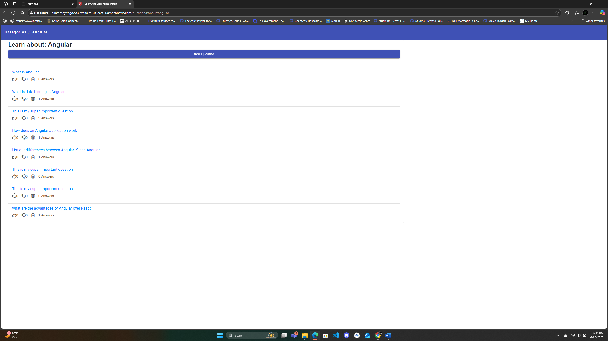

# Questions & Answers Serverless API

A serverless Questions & Answers platform built with **AWS Lambda**, **API Gateway**, and **DynamoDB**, with an **Angular frontend** hosted on **AWS S3/CloudFront**.  
This project demonstrates full CRUD operations for Questions and Answers, integrated into a modern web UI.

---

## 🚀 Features
- **Serverless REST API (API Gateway + Lambda)**
  - `POST /Questions` → Create a new question  
  - `GET /Questions` → Retrieve all questions  
  - `GET /Questions/{id}` → Retrieve a specific question  
  - `PUT /Questions/{id}` → Update an existing question  
  - `DELETE /Questions/{id}` → Delete a question  
  - `POST /Answers` → Create an answer for a question  
  - `GET /Answers/{id}` → Retrieve answers linked to a question  
  - `PUT /Answers/{id}` → Update an answer  
  - `DELETE /Answers/{id}` → Delete an answer  

- **CORS Enabled** for frontend integration  
- **DynamoDB Storage** for Questions & Answers  
- **Angular Frontend** hosted on S3 + CloudFront for real-time interaction  

---

## 🖥️ Screenshots

### 1. API Gateway Overview

### 2. API Resources & Methods

### 3. CORS Setup for /Answers

### 4. CORS Setup for /Answers/{id}

### 5. CORS Setup for /Questions

### 6. CORS Setup for /Questions/{id}

### 7. CORS Setup for /Questions/findOne

### 8. Angular Frontend – Q&A Board

### 9. Angular Frontend – Single Question View

---

## 🛠️ Tech Stack
- **Backend:** AWS Lambda, API Gateway, DynamoDB  
- **Frontend:** Angular (S3 + CloudFront)  
- **Languages:** Node.js (Lambda), TypeScript (Angular)  

---

## 📂 Project Structure
